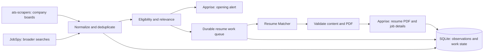

# Internship search pipeline — build plan

Prepared October 5, 2026. Status: proposed implementation; nothing deployed.

## Outcome

Run an always-on personal pipeline that finds relevant SWE, product management, ML/AI and data science internships, produces a role-specific resume PDF, and sends the job details and PDF to the user. The user reviews and submits the application.

Use **ats-scrapers → JobSpy → Resume Matcher → Apprise**, with a small Python application coordinating them. ats-scrapers and JobSpy are parallel discovery inputs, not sequential dependencies. Fast direct polling is the primary source; broad searches expand coverage and discover additional companies to monitor.

Personal settings still to confirm: locations/countries, internship term, degree and graduation date, work authorization, notification destination, priority companies, master resume, and LLM provider. The plan provisionally recommends Telegram for mobile alerts and PDF attachments; it does not assume an answer or create a bot. Missing eligibility settings remain unknown rather than becoming invented filters.

## 1. Architecture and operating targets

Deploy one Python codebase with separate collector, resume-worker and delivery-worker processes using Docker Compose on one always-on Linux host. Deploy Resume Matcher using its supported container setup, including the components its PDF rendering requires. Store pipeline state in SQLite with WAL mode, short transactions and persistent local storage. Store private resume artifacts on a persistent volume. SQLite is appropriate for this single-user, single-host workload; no Redis, distributed broker or custom dashboard is required.

Collector scheduling must not wait for generation or notification delivery. Blocking JobSpy searches run in isolated worker processes with timeouts. Resume Matcher can fail or restart without stopping collection. A small CLI provides `scan`, `status`, `retry`, `add-company` and `mark-applied` operations; retain Resume Matcher's existing UI for reviewing resumes.

| Work | Initial operating target | Reason |
|---|---|---|
| Priority company boards | Every 2–5 minutes | Give the shortest checks to the companies the user most wants. Begin at 5 minutes and shorten healthy providers after verification. |
| Other monitored boards | Every 10–15 minutes | Expand coverage without exhausting provider request budgets. |
| JobSpy searches | Every 30–60 minutes | Broad discovery runs independently of the fast company checks. |
| Company-directory refresh | Daily | Newly discovered supported boards enter direct monitoring after validation. |
| Opening notification | Within 30 seconds of a relevance decision | Deliver the application link without waiting for resume generation. |
| Resume-ready notification | Target p95 within 2 minutes of relevance decision | Include queue time, generation, PDF validation and delivery; benchmark before treating this as an operating commitment. |

These are design targets, not upstream service guarantees. Publication-to-detection time includes the employer's feed delay, polling interval and request duration. Jobs found only through an aggregator inherit that aggregator's indexing delay. Measure source publication, our first observation, relevance completion, PDF readiness and delivery separately. Where the source supplies only an update/republish time, label it accordingly.

## 2. Collect postings quickly

Maintain a company registry containing name, careers URL, provider/board identifier, priority, next due check, last successful check and failure state. Begin with approximately 100–200 relevant companies, with a smaller priority group. Seed it from the ats-scrapers directory and public internship lists, then incorporate employers discovered by JobSpy. An unsupported or unresolved board remains explicitly uncovered until an adapter exists.

The [ats-scrapers library](https://github.com/kalil0321/ats-scrapers) supports direct company fetching and asynchronous `afetch()`. Validate installed adapter availability instead of assuming every source in its hosted dataset has a reusable scraper. Use those direct adapters for frequent checks; the hosted snapshot is a discovery source, not the clock for priority alerts.

Each board has its own due time. Apply bounded concurrency, provider-wide request budgets, staggered start times and a small amount of jitter. Reuse HTTP sessions where the library permits it. Honor rate-limit responses and `Retry-After`, apply bounded exponential backoff, and prevent overlapping runs for the same board. Count all pagination and detail requests in the request budget. Shrink the fast-watch set if scheduled checks cannot finish on time; do not silently claim all boards retain the same cadence.

Use [JobSpy](https://github.com/speedyapply/JobSpy) for separate role-family/location queries. Persist source identifiers, fetch descriptions for plausible matches and use overlapping recent-result windows so a missed run does not create a gap. Verify each board's supported filter combinations against the pinned version. Partition searches that hit result caps; record incomplete coverage rather than treating the first page as exhaustive. Its README documents rate limits and differing timestamp semantics, so do not accelerate all boards to the ATS polling frequency.

Normalize results as they arrive; do not wait for a full multi-company sweep before processing new jobs. Prefer a verified employer application URL, retaining the original source URL as provenance. Recheck an available direct source before generating a resume for an aggregator-only result.

## 3. Identify new jobs without duplicate alerts

Use the provider, company board and stable posting ID as the primary source identity. Link observations across sources using a canonical employer application URL or matching employer requisition ID. Title/company/location similarity can flag a possible duplicate, but must not automatically merge different requisitions. Preserve meaningful URL parameters and location variants.

Store the original description and a normalized content hash. A description edit updates the existing job; it does not become a newly opened role. A repost or reopening receives an explicit label. Preserve source timestamps alongside `first_seen_at`, `last_seen_at` and `last_verified_at`.

On first startup, baseline each board. Review existing matches once as an initial backlog, labeled as such, then alert on subsequent additions. Newly added companies also receive a baseline; an old role on a newly discovered board must not be announced as just published. A failed or incomplete fetch cannot establish that a job closed. Mark a job unavailable only after an authoritative closure response or repeated complete snapshots that omit it.

## 4. Decide relevance and eligibility

Use one candidate profile with four role-family views. The profile contains the user's actual eligibility and a factual bank of experience, projects, skills and accomplishments. The views emphasize different evidence without maintaining four conflicting personal histories.

Apply inexpensive checks first: internship/co-op status, role family, geography, term, degree/graduation requirements and explicit work-authorization conditions. Inspect descriptions as well as titles; ambiguous titles can reach the classification step. Product management must not automatically include project management, and a research internship's degree requirement must be read rather than guessed from its title.

For plausible matches, use a short structured LLM assessment returning role family, strong/possible/weak fit, supporting requirement excerpts, matched experience IDs, missing qualifications and eligibility unknowns. Hard rejection requires an explicit conflict with a confirmed user constraint. Missing information stays unknown. Strong and plausible matches receive alerts, with uncertainties visible; weak or explicitly ineligible roles remain searchable in storage without triggering resume generation.

The matching step should explain relevance rather than present a fabricated percentage chance of getting an interview. Test it against a small labeled set of internship descriptions before enabling automatic filtering.

## 5. Generate and validate the resume

Import the user's master resume into a private [Resume Matcher](https://github.com/srbhr/Resume-Matcher) deployment and verify the resulting structured content once. Keep a factual profile revision in pipeline storage. Use a warm, low-latency supported model endpoint; benchmark the selected cloud or local model with the same representative jobs before setting the final generation target.

Build a narrow client around the installed Resume Matcher API: submit the job description, request tailored content, retain the generated resume ID and retrieve its PDF. The [job routes](https://github.com/srbhr/Resume-Matcher/blob/main/apps/backend/app/routers/jobs.py) and [resume routes](https://github.com/srbhr/Resume-Matcher/blob/main/apps/backend/app/routers/resumes.py) are the integration references. Verify the installed OpenAPI schema and actual request sequence in the first milestone, then pin that working version.

Tailoring selects and rephrases supported experience, brings relevant projects forward and uses job terminology only where truthful. Preserve identity, employers, dates, degrees and measured results. Treat the job description as matching data, never as executable instructions. Save a short change summary alongside the PDF. Automated validation can catch unsupported skills and changed factual fields but cannot guarantee every paraphrase is accurate; a questionable draft receives a visible review-needed status.

Validate the output before sending it: nonempty readable PDF, extractable text, required sections and contact details present, acceptable page count and no obvious overflow. Visually verify the selected template during integration. Use a one-page default for internship resumes unless the user's material warrants another agreed layout. Save artifacts under a stable job identifier with company and role in the filename.

Use a generation key derived from canonical job, relevant description hash, profile revision and generation configuration. Repeated observations reuse the existing artifact. A worker crash resumes from the last known step; an ambiguous generation response is reconciled before creating another draft. Resume generation is not application submission, so the pipeline owns the `applied` status independently of Resume Matcher's tracker.

## 6. Send actionable alerts and the PDF

Use [Apprise](https://github.com/caronc/apprise) with the selected destination. Send an opening alert as soon as relevance is established, then a resume-ready message containing the PDF and the same stable job reference. Use two messages, without depending on cross-service message-edit support. Group simultaneously discovered location variants of one requisition where that identity is verified.

Each opening alert contains:

- Company, role, location/work arrangement and internship term.
- Source publication/republish time when available and our detection time, with distinct labels.
- Two or three concrete fit reasons and any eligibility questions.
- Compensation and deadline when explicitly supplied.
- Direct application URL and the stable job reference.

The resume-ready message repeats the apply link, attaches the tailored PDF and adds a concise change summary. If generation fails, the opening remains delivered; report the resume failure and retry the generation task. Never label an untailored document as tailored. A final freshness check can suppress a known-closed job; a transient check failure should be shown as unverified rather than hiding the opportunity.

Apprise supports attachments for compatible services. Confirm PDF delivery on the chosen destination during setup and verify its size limits. Store one delivery record per job, message kind, artifact revision and destination. Persist attempts and retry transient failures after restart. Service acceptance is not proof the user read the notification. An ambiguous network timeout can still cause an occasional duplicate; use the stable reference to make it recognizable rather than promising exactly-once delivery.

## 7. State, recovery and operations

Keep these concerns separate in the Python package: `sources`, `scheduler`, `normalization`, `matching`, `resumes`, `notifications`, `storage` and a small CLI. Use normal Python modules and typed records rather than a generic plugin framework.

The database stores companies, canonical jobs and source observations, profile revisions, match decisions, resume tasks/artifacts, delivery records and polling history. Jobs and required downstream work are committed in one transaction. Workers claim tasks with an expiring lease; retries survive process restarts. Notification retries reuse PDFs and do not rerun the LLM.

Persist useful health measures: overdue boards, last successful check per provider, incomplete result sets, rate-limit responses, generation backlog, delivery failures and actual stage latencies. Record estimated model usage per generated resume. Alert on sustained collection or delivery failure through a separately verified channel if the user configures one; expose health locally regardless. Never treat a silently broken scraper as a lack of openings.

Keep API keys and messaging tokens outside source control, redact them from logs, and keep Resume Matcher accessible only through the private deployment network or authenticated access. Back up the database and factual resume source, and retain delivered PDFs so a notification can be retried. Run on a host that stays awake; a sleeping laptop cannot meet the detection target.

## 8. Build in working increments

| Milestone | Work | Acceptance gate |
|---|---|---|
| 1. Verify the integrations | Pin tool versions; fetch one representative company board; run one JobSpy query; submit a real provided master resume and sample JD to Resume Matcher; send the resulting PDF through the chosen Apprise destination. | Each tool's actual request/response and failure behavior is recorded; the user receives a readable sample PDF. Live delivery begins only after the destination is supplied. |
| 2. Complete the smallest pipeline | Watch 5–10 companies, store observations, apply relevance rules, generate a resume and deliver both messages. | A controlled new relevant posting yields one opening alert and one corresponding PDF; a repeated snapshot yields neither again. |
| 3. Harden recovery and resume quality | Add persistent work leases, retry state, cross-source deduplication, eligibility uncertainty, PDF checks and factual-field checks. | Restart during generation or notification and recover without losing work; rate limiting or one broken board does not stop healthy boards. |
| 4. Expand coverage and tune speed | Add the wider company registry, priority schedules, JobSpy queries and validated new-company discovery. | A representative 24-hour run meets observed scheduling/processing targets, surfaces incomplete coverage and stays within provider limits. |
| 5. Operate continuously | Deploy on the always-on host, verify backups and health reporting, calibrate matching with user feedback. | Every priority board has a visible recent successful check; every qualified job has either a delivered PDF or an explicit retry/failure state. |

Use meaningful regression cases for same job across sources, different requisitions sharing a title, description edits, first-run backlog, partial pagination, rate limits, missing eligibility, closed jobs, queue recovery, hallucinated factual changes and broken PDFs. Test notification failure and ambiguous delivery separately from successful delivery. Measure generation latency with real resume/JD pairs before increasing concurrency.

## Definition of done

The pipeline runs continuously on the selected host, checks the priority company list at the verified cadence, searches the broader boards independently, recognizes relevant internships without repeated alerts, produces traceable tailored PDFs, and sends them with application details to the user's selected destination. It recovers from transient failures and makes coverage gaps visible. Final rollout requires the user's profile, resume, destination credentials and model configuration; no unprovided preference is silently turned into an eligibility rule.
